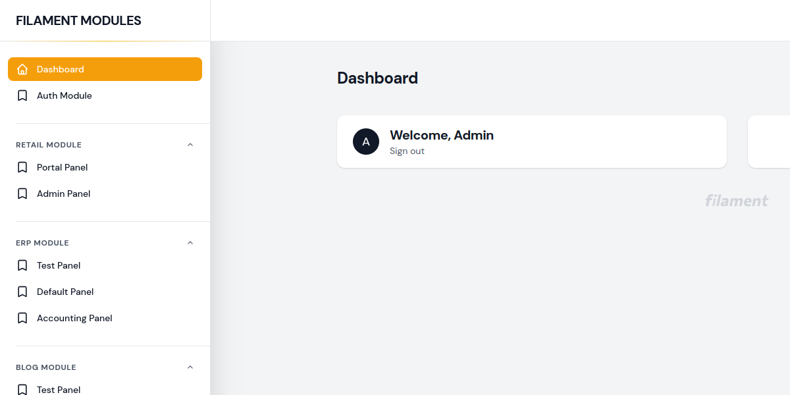
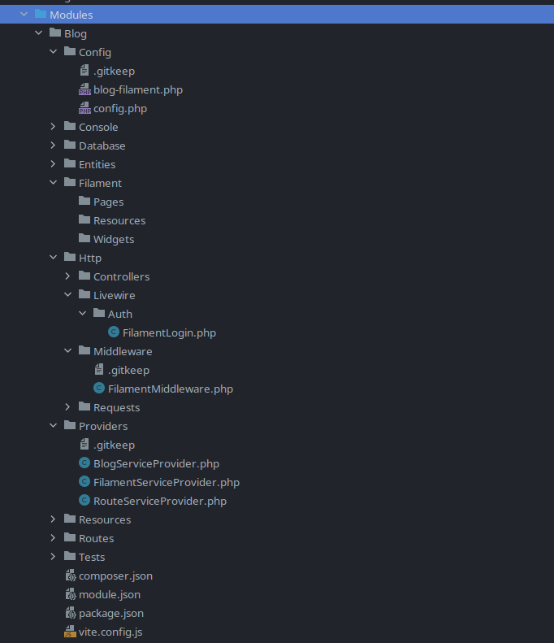

<<<<<<< HEAD
<p align="center">
    <a href="https://github.com/savannabits/filament-modules/actions?query=workflow%3Arun-tests+branch%3A3.x"></a>
    <a href="https://github.com/savannabits/filament-modules/actions?query=workflow%fix-php-code-style-issues+branch%3A3.x"></a>
    <a href="https://laravel.com"></a>
    <a href="https://beta.filamentphp.com"></a>
    <a href="https://php.net"></a>
    <a href="https://packagist.org/packages/coolsam/modules"></a>
</p>
=======
# Use FilamentPHP with nwiDart/laravel-modules
>>>>>>> c73ff38 (Added README guide)

Modules is a FilamentPHP Plugin to enable easy integration with `nwidart/laravel-modules`

<<<<<<< HEAD
**NB: These docs are for v3, which only supports Filament 3. If you are using Filament
v2, [see the documentation here](https://github.com/savannabits/filament-modules/tree/main#readme) to get started.**

For example, if you have two modules (**Blog** and **Pos**), you should be able to have filament installed in each module with separate resources as below:
- Directory **Modules/Blog/Filament** should enable you to access the admin panel via `http://yoururl/blog/admin`
- Directory **Modules/Pos/Filament** should enable you to access the admin panel via `http://yoururl/pos/admin`
- We can even have another context under **Modules/Pos/Filament2** should enable you to access the admin panel via `http://yoururl/pos/admin2` or whichever path you configure for that context.

Each of the above directories should have their own distinct **Pages, Resources** and **Widgets**. Each of them also has a config under the module's Config folder allowing you to customize a number of parameters per context, e.g the `path`.
Additionally, each of these can have its own customized login page which redirects back to the module.

You can read more about Multiple Context for Filament [Here](https://github.com/iotronlab/filament-multi-guard).

If this is your goal, then you are in the right place.
 
## Installation
Before you proceed, this guide assumes that you have configured your app fully to work with Laravel Modules. If you haven't, follow the [Laravel Modules Docs](https://docs.laravelmodules.com/v9/installation-and-setup) before proceeding.

Requirements:

1. Filament >= 3
2. PHP >= 8.1
3. Laravel >= 9.0
4. Livewire >= 3.0
5. nwidart/laravel-modules >=10.0
=======


This plugin provides you with a quick and working configuration to install multiple filament admin contexts in your modular laravel app (using [laravel-modules](https://github.com/nWidart/laravel-modules)).

## Goal
The goal of this app is to enable you install multiple contexts of Filament Admin per module in your LaravelModules powered app.
>>>>>>> c73ff38 (Added README guide)

For example, if you have two modules (**Blog** and **Pos**), you should be able to have filament installed in each module with separate resources as below:
- Directory **Modules/Blog/Filament** should enable you to access the admin panel via `http://yoururl/blog/admin`
- Directory **Modules/Pos/Filament** should enable you to access the admin panel via `http://yoururl/pos/admin`
- We can even have another context under **Modules/Pos/Filament2** should enable you to access the admin panel via `http://yoururl/pos/admin2` or whichever path you configure for that context.

Each of the above directories should have their own distinct **Pages, Resources** and **Widgets**. Each of them also has a config under the module's Config folder allowing you to customize a number of parameters per context, e.g the `path`.
Additionally, each of these can have its own customized login page which redirects back to the module.

You can read more about Multiple Context for Filament [Here](https://github.com/iotronlab/filament-multi-guard).

If this is your goal, then you are in the right place.
 
## Installation
Before you proceed, this guide assumes that you have configured your app fully to work with Laravel Modules. If you haven't, follow the [Laravel Modules Docs](https://docs.laravelmodules.com/v9/installation-and-setup) before proceeding.

- Ensure you have insalled and configured [Laravel Modules (follow these instructions)]()
- Ensure you have installed and configured Filamentphp (follow these instructions)
- You can now install the package via composer:

```bash
<<<<<<< HEAD
composer require coolsam/modules
=======
composer require savannabits/filament-modules
>>>>>>> c73ff38 (Added README guide)
```

## Usage

<<<<<<< HEAD
In this guide we are going to use the `Blog module` as an example

### Create your laravel module:
If the module that you want to work on does not exist, create it using nwidart/laravel-modules

```bash
php artisan module:make Blog # Create the blog module
```

### Generate a new Panel inside your module

```bash
php artisan module:make-filament-panel admin Blog # php artisan module:make-filament-panel [id] [module]
```
If none of the two arguments are passed, the command will ask for each of them interactively.
In this example, if the Panel id passed is `admin` and the module is blog, the command will generate a panel with
id `blog::admin`. This ID should be used in the next step when generating resources, pages and widgets.

### Generate your resources, pages and widgets as usual, selecting the panel you just created above.
From here on, use filament as you would normally to generate `resources`, `Pages` and `Widgets`. Be sure to specify the `--panel` option as the ID generated earlier.
If the `--panel` option is not passed, the command will ask for it interactively.
```bash
# For each of these commands, the package will ask for the Model and Panel.
php artisan make:filament-resource
php artisan make:filament-page
php artisan make:filament-widget
```

```bash
# The Model and Panel arguments are passed inline
php artisan make:filament-resource Author blog::admin
php artisan make:filament-page Library blog::admin
php artisan make:filament-widget BookStats blog::admin
```

**All Done!** For each of the panels generated, you can navigate to your `module-path/panel-path` e.g `blog/admin` to acess your panel and links to resources and pages.
=======
To generate a new Filament Context, use the `module:make-filament-context` command.
You can run `php artisan module:make-filament-context -h` to see the expected arguments.

```bash
#Option 1: Pick an existing module to use first, then run the command (similar to other laravel-modules commands)
php artisan module:use Blog
php artisan module:make-filament-context Filament # This will create the Filament context inside the blog module.

# Option 2: Pass the Module name as an argument. If the module does not exist, it will be automatically created.
php artisan module:make-filament-context Filament Blog # This will create the Filament context inside the blog module.
```
### Directory Structure of the generated module:

### Config:
The configuration for each of the generated contexts will be stored under the module's Config directory, e.g `/Modules/Blog/Config/blog-filament.php` in the above case.
You can adjust the config to change several parameters, for example the admin panel path (by default it is `admin`).

### The context's admin panel path
By default, you should be able to access your admin panel under the url `http://yoururl/:yourModule/:yourPathConfig` e.g `http://yoururl/blog/admin` in the above case.
If you would like to change the path, you can change it under the corresponding config file.

### The Context's Service Provider
This package automatically adds each of the generated context's service provider in providers' list in `app.php config`. Be sure to remove this Service Provider in case you delete the context.
>>>>>>> c73ff38 (Added README guide)
## Testing

```bash
composer test
```

## Changelog

Please see [CHANGELOG](CHANGELOG.md) for more information on what has changed recently.

## Contributing

Please see [CONTRIBUTING](CONTRIBUTING.md) for details.

## Security Vulnerabilities

Please review [our security policy](../../security/policy) on how to report security vulnerabilities.

## Credits

- [Sam Maosa](https://github.com/coolsam726)
- [All Contributors](../../contributors)

## License

The MIT License (MIT). Please see [License File](LICENSE.md) for more information.
